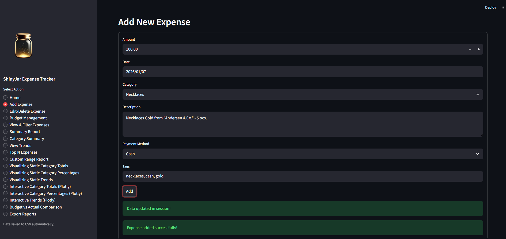
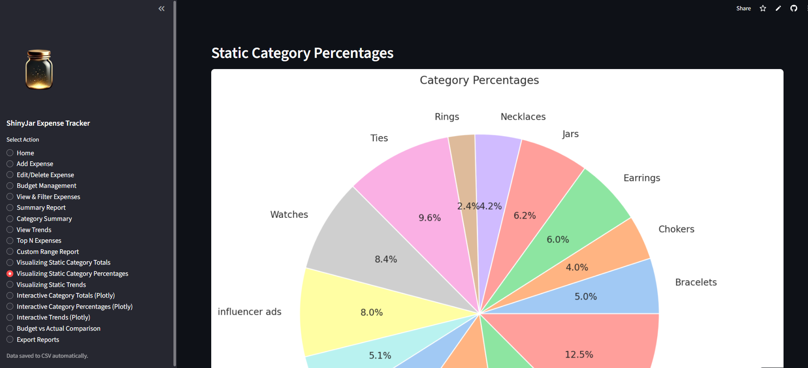
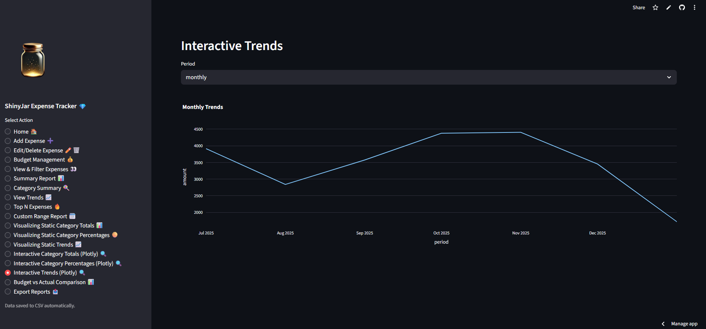
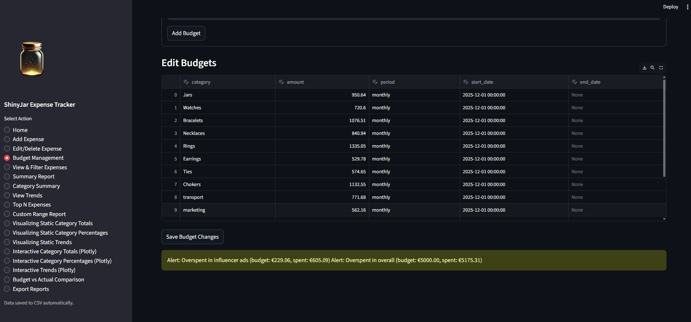
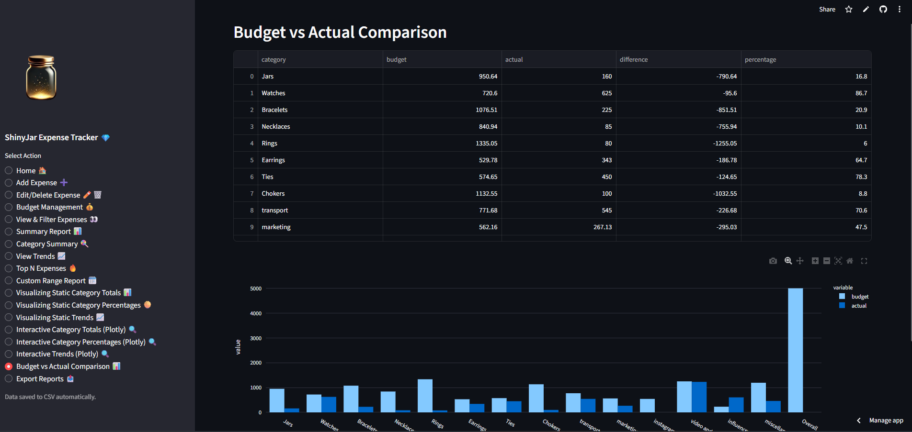

# 💎 UNYT Expense Tracker – ShinyJar Edition

[](https://www.python.org/)
[](https://streamlit.io/)
[](LICENSE)


A powerful Python expense tracking application designed for small businesses and personal finance management. Originally developed as a Master's project at UNYT, this tool has been extended with real-world features inspired by **ShinyJar** – my jewelry business on Instagram and TikTok.

- **🔗 Live Demo:** [Try it on Streamlit Cloud](https://boramalaj-unyt-cloud-expense-tracker.streamlit.app/)
- **🔗 ShinyJarSuite CRM Backend/Frontend download:** [Download from GitHUb ](https://github.com/BoraMalaj/shiny_jar_crm)
- **🔗 ShinyJarSuite CRM Backend:** [Check the Endpoints on Railway ](https://shinyjarcrm-production.up.railway.app/docs)
- **🔗 ShinyJarSuite CRM Frontend:** [Try the full Application on Railway ](https://graceful-delight-production.up.railway.app/)

---

## 🎯 Project Overview

This application helps users track and analyze daily expenses with professional-grade features including budget management, real-time alerts, and comprehensive reporting. Whether you're managing jewelry supplies, marketing campaigns, or personal finances, this tool provides the insights you need.

### Why This Project?

Managing expenses for ShinyJar taught me that basic spreadsheets aren't enough. I needed:
- **Real-time budget tracking** for gold purchases and Instagram ads
- **Instant alerts** when spending exceeds limits
- **Visual analytics** to spot trends and optimize spending
- **Professional reports** for business planning

This project combines academic rigor with practical business needs.

---

## ✨ Key Features

### 📝 Expense Management
- **Add expenses** with detailed fields: amount, date, category, description, payment method, tags
- **Edit or delete** existing records with an intuitive interface
- **Bulk operations** for efficiency

### 💰 Budget Tracking & Alerts
- Set **monthly or category-specific budgets**
- **Real-time overspending alerts** on the dashboard
- Visual indicators (red warnings) for budget violations
- Track budget vs. actual spending side-by-side

### 🔍 Dynamic Filtering & Analysis
- Filter by date range, category, payment method, amount range, or tags
- Sort expenses by any field
- **Advanced summary reports** including:
  - Total, average, median, min, max, and standard deviation
  - Category-wise breakdowns with percentages
  - Monthly, quarterly, and yearly trends
  - Top N expenses for quick insights
  - Custom date range analysis

### 📊 Visual Analytics
- **Static charts** (Seaborn) for publication-quality visuals
- **Interactive charts** (Plotly) with hover, zoom, and drill-down capabilities
- Category distribution pie charts
- Monthly/yearly trend lines
- Budget vs. Actual comparison charts

### 💾 Data Persistence & Export
- **Excel-based storage** (single file, two sheets: Expenses + Budgets)
- Easy offline editing and backup
- **Export options:**
  - Full Excel workbook download
  - PDF reports with tables
  - PNG charts for presentations
  - CSV data exports

---

## 🚀 Quick Start

### Prerequisites
- Python 3.12 or higher
- pip package manager

### Installation

1. **Clone the repository:**
   ```bash
   git clone https://github.com/BoraMalaj/unyt_expense_tracker.git
   cd unyt_expense_tracker
   ```

2. **Install dependencies:**
   ```bash
   python -m venv venv
   source venv/bin/activate
   pip install -r requirements.txt
   ```

3. **Run the Streamlit app:**
   ```bash
   cd streamlit_browser_version
   streamlit run streamlit_expense_tracker.py
   ```

4. **Generate demo data (optional):**
   ```bash
   cd streamlit_browser_version
   python dummy_data_generator.py
   ```

The app will open in your browser at `http://localhost:8501`

### Available Versions

- **📱 Streamlit Web Version:** `streamlit_browser_version/` - Interactive dashboard with full features
- **💻 Terminal Version:** `terminal_version/` - Command-line interface for advanced users

---

## 🎮 Live Demos

### Version 1: Clean Start
**🔗 [Empty Dashboard](https://boramalaj-unyt-expense-tracker.streamlit.app/)**
- Start fresh and add your own data manually
- Perfect for testing and learning the interface

### Version 2: With Sample Data
**🔗 [Pre-loaded with Jewelry Business Data](https://boramalaj-unyt-cloud-expense-tracker.streamlit.app/)**
- Includes realistic ShinyJar expense examples
- Upload custom CSV files to see your own data
- Check CSV format requirements in the app

---

## 🛠️ Technical Architecture

### Core Technologies
- **Python 3.12+** – Primary programming language
- **Streamlit** – Interactive web dashboard framework
- **Pandas** – Data manipulation and analysis
- **NumPy** – Efficient numerical computations
- **Matplotlib & Seaborn** – Static visualization
- **Plotly** – Interactive charts
- **openpyxl** – Excel file operations

### Design Principles
- **Object-Oriented Programming (OOP):** Clean, modular classes for Expense, ExpenseManager, ReportGenerator, and Visualizer
- **Separation of Concerns:** Each module has a single, well-defined responsibility
- **Error Handling:** Comprehensive try/except blocks with user-friendly messages
- **Data Validation:** Input validation for amounts, dates, and categories

### Code Structure
```
unyt_expense_tracker/
├── streamlit_browser_version/
│   ├── streamlit_expense_tracker.py   # Main Streamlit app
│   ├── expense_manager.py             # Core expense logic
│   ├── report_generator.py            # Analytics engine
│   ├── visualizer.py                  # Chart generation
│   ├── dummy_data_generator.py        # Sample data creator
│   └── logo.png                       # App branding
├── terminal_version/
│   └── expense_tracker.py             # CLI version
├── requirements.txt                   # Python dependencies
└── README.md                          # This file
```

---

## 📸 Screenshots

### Dashboard Overview

*Real-time budget alerts and expense summary*

### Manage Expenses

*Add new expenses*

### Vistualizing Static Charts

*View static charts of categories by percentage*

### Interactive Charts

*Hover over data points for detailed insights*

### Budget Management

*Set and track category-specific budgets*

### Budget vs. Actual Spendings

*Check the actual spendings vs. budgeted*

_(Other screenshots to be added)_

---

## 🎓 Use Cases

### For Small Business Owners
- Track inventory purchases (e.g., gold, gemstones for jewelry)
- Monitor marketing spend (Instagram ads, influencer collaborations)
- Generate monthly financial reports for tax planning

### For Freelancers & Contractors
- Categorize project-related expenses
- Track client-specific costs
- Export reports for invoicing and reimbursement

### For Personal Finance
- Monitor daily spending habits
- Set savings goals with budget tracking
- Analyze spending patterns over time

---

## 🔮 Future Enhancements

- [ ] Multi-currency support
- [ ] Recurring expense templates
- [ ] Mobile app (React Native)
- [ ] Cloud sync across devices
- [ ] Receipt photo uploads with OCR
- [ ] Predictive spending analytics using ML
- [ ] Multi-user collaboration for teams

---

## 🤝 Contributing

Contributions are welcome! Here's how you can help:

1. Fork the repository
2. Create a feature branch (`git checkout -b feature/AmazingFeature`)
3. Commit your changes (`git commit -m 'Add some AmazingFeature'`)
4. Push to the branch (`git push origin feature/AmazingFeature`)
5. Open a Pull Request

Please ensure your code follows PEP 8 style guidelines and includes appropriate tests.

---

## 📄 License

This project is licensed under the MIT License - see the [LICENSE](LICENSE) file for details.

---

## 👨‍💻 About the Developer

**Bora Malaj**  
Master's Student at UNYT | Entrepreneur | Python Developer

This project combines my academic work with real-world business experience from running ShinyJar, my jewelry business. I believe the best software solutions come from solving real problems.

**Connect with me:**
- 📧 Email: [boramalaj0@gmail.com](mailto:boramalaj0@gmail.com)
- 💼 GitHub: [@BoraMalaj](https://github.com/BoraMalaj)
- 💎 Business: ShinyJar on Instagram & TikTok

---

## 🙏 Acknowledgments

- **UNYT University** – For the Master's program foundation
- **Our professor, Dr. Nelda Kote** – For detailed project specifications and guidance
- **Streamlit Community** – For the incredible framework and hosting
- **ShinyJar Customers** – Real-world testing and feedback
- **Open Source Contributors** – NumPy, Pandas, Matplotlib, and Plotly teams

---

## 📝 Project Status

**Status:** ✅ Active Development  
**Version:** 1.0.0  
**Last Updated:** January 2026

---

**Built with ❤️ for real businesses by someone who understands the struggle of managing expenses while building a dream.**